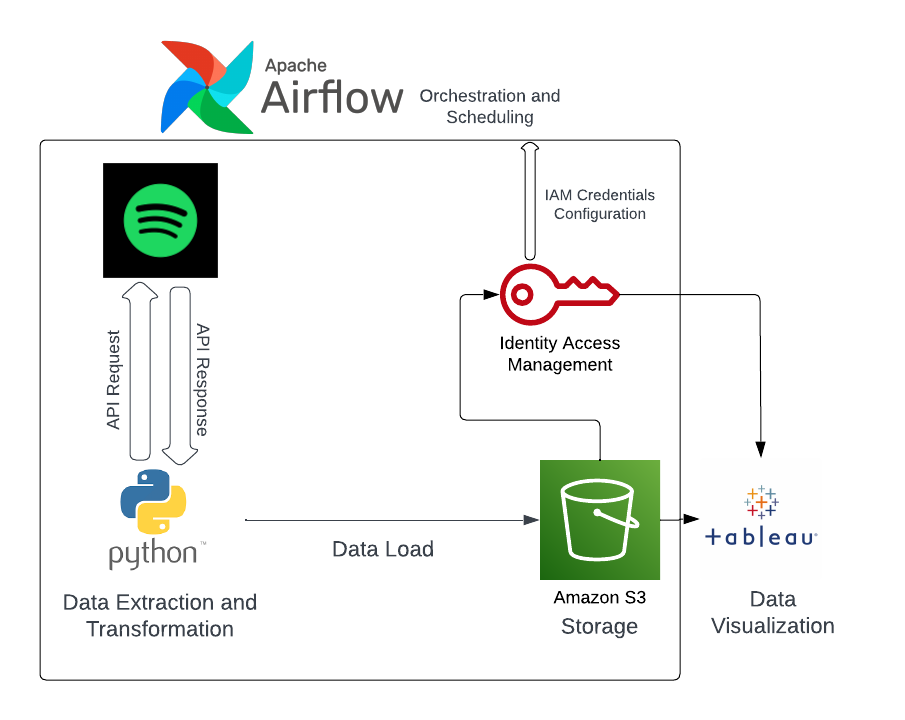
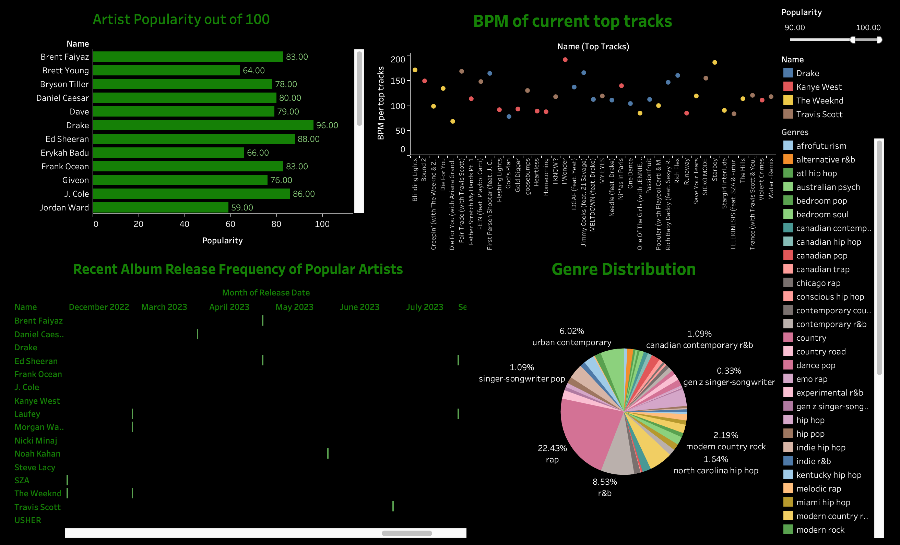
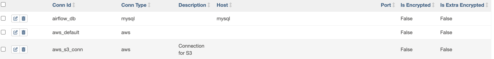
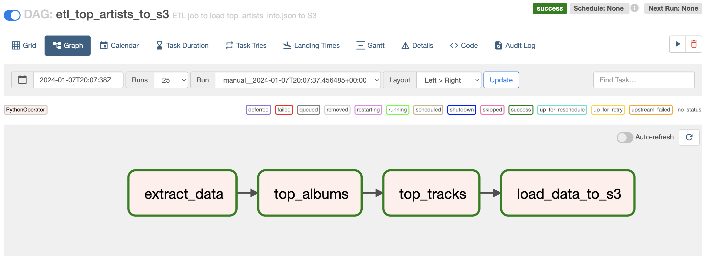

# Spotify Top Artists Data Visualization Project

## Project Overview
This project leverages Spotify's API to extract data on your top artists, loads this data into Amazon S3, and utilizes Tableau for creating dynamic dashboard visualizations. It offers a comprehensive view of your musical preferences and trends over time.

## Architecture
Below is the architecture diagram illustrating the workflow of the project:

## Features
- **Data Extraction**: Utilize Spotify's API to gather data on your top artists, including genres, popularity scores, and related metrics.
- **Data Storage**: Securely load and store extracted data in an Amazon S3 bucket.
- **Data Visualization**: Connect to Tableau for creating interactive dashboards that provide insights into your music listening habits.

## Getting Started

### Prerequisites
- A Spotify account with API access.
- An AWS account with S3 set up.
- Tableau Desktop or Tableau Public for visualization.

## Extracting Data from Spotify API 
1.0 First, we authenticate with Spotify using the `SpotifyOAuth` class, which requires a `client_id`, `client_secret`, `redirect_uri`, and a `scope` for the required permissions.

## Authentication
First, we authenticate with Spotify using the `SpotifyOAuth` class, which requires a `client_id`, `client_secret`, `redirect_uri`, and a `scope` for the required permissions.

### Fetch Top Artists
We use the `current_user_top_artists` method to fetch the user's top artists over a short-term range, limited to 50 artists.

### Extract Artist Information
For each artist, we extract:
- Name
- Genres
- Popularity

### Fetch Top Albums
For each artist, we fetch the top 5 albums, including:
- Name
- ID
- Release date
- Total tracks

### Fetch Top Tracks
For each artist, we fetch their top tracks in the US, and for each track, we gather:
- Name
- Duration (converted from milliseconds to minutes and seconds)
- BPM (Beats Per Minute)
- Mode (Major or Minor)

### Compile Data
All the extracted information is compiled into a list of dictionaries, each containing detailed data about an artist.

The final output is a list of artist information, ready for storage or further analysis.
 
## Airflow Configuration 
Install Apache Airflow
- Install Airflow using pip:
- pip install apache-airflow
### Initialize Airflow Environment
- Set `AIRFLOW_HOME` (optional): export AIRFLOW_HOME=~/airflow
Replace `~/airflow` with your preferred directory.
- Initialize the database: airflow db init
### Configure Airflow
- Edit the `airflow.cfg` file in the `AIRFLOW_HOME` directory as needed for your setup.
### Create a User
- Create an admin user:
airflow users create --username [username] --password [password] --role Admin --email [email]
### Start Airflow Components
- Start the webserver and scheduler:
airflow webserver -D
airflow scheduler -D 
### Access Airflow Web Interface
- Go to `http://localhost:8080` in your web browser and log in with the user you created.
- Write your DAGs and place them in the `dags` directory inside `AIRFLOW_HOME`.
- Use the Airflow web interface to test and monitor your DAGs.
### Create a Connection from Airflow to S3 using IAM credentials
- Add a new S3 connection on the Airflow webserver with connection ID as "aws_s3_conn" using your IAM credentials that grant full access to S3  
- The connection will now be displayed on the Connections page 

### Run and monitor DAG
-Trigger and monitor DAG 
- Verify DAG performance using Graph view 

